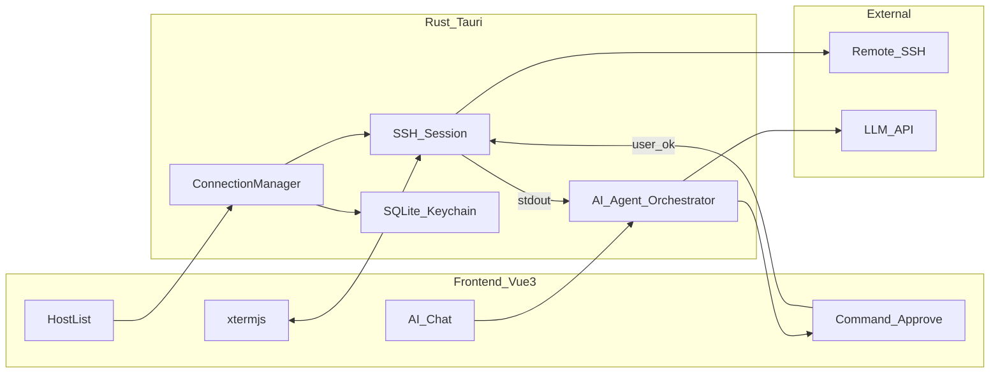

# PeekShell 架构与技术栈方案

轻量跨平台 SSH 客户端（对标 FinalShell 的核心体验），内置「提议命令 → 用户确认 → 执行」的 AI Agent。

**推荐技术栈**：Tauri 2 + Rust + Vue 3 / TypeScript / Vite + xterm.js

---

## 产品定位

轻量桌面端 SSH 工具（Windows / macOS / Linux），核心能力：

- 主机管理、SSH 多标签终端
- 连接后可接入 AI：用户用自然语言提问，AI 基于当前会话上下文给出可执行命令
- **必须人工确认后才执行**（安全优先的 Agent 闭环）

**MVP 范围**：SSH + 多标签终端 + AI Agent；SFTP、端口转发等放到后续版本。

---

## 推荐技术栈（为何选它）

| 层级 | 选型 | 理由 |
|------|------|------|
| 桌面壳 | **Tauri 2** | 体积远小于 Electron（通常十几 MB 级 vs 百 MB+），更贴「轻量」 |
| 后端 / 原生能力 | **Rust** | SSH、加密、并发、系统钥匙串都适合；与 Tauri 同语言 |
| SSH | **russh**（或 ssh2 crate） | 纯 Rust SSH，便于在 Rust 侧管理会话与命令执行 |
| 终端 UI | **xterm.js** + 插件 | 业界成熟的 Web 终端，多标签、复制粘贴、主题都好做 |
| 前端 | **Vue 3 + TypeScript + Vite** | 官方与 Tauri 模板成熟；Composition API 适合终端/聊天状态管理 |
| 本地存储 | **SQLite**（via `rusqlite` / `tauri-plugin-sql`） | 主机、会话历史、AI 审计日志 |
| 密钥 | OS 钥匙串 + Tauri 安全存储 | 密码/私钥口令不落明文配置文件 |
| AI | **OpenAI 兼容 API**（用户自带 Key） | 可接 OpenAI / 兼容中转 / 本地 Ollama；不绑死单一厂商 |

**不推荐作为首选的原因（简述）**：

- **Electron**：生态成熟，但体积与内存偏重，和「轻量」目标冲突
- **纯 Java（FinalShell 路线）**：跨平台可以，但启动与包体不如 Tauri 轻
- **Flutter**：UI 不错，SSH/伪终端生态不如 Rust + xterm.js 成熟



---

## 核心模块设计

### 1. 连接与终端

- **ConnectionManager**：主机配置（地址、端口、用户、认证方式、分组）、连接生命周期、断线重连提示
- **SSH Session**：每个标签一个会话；PTY 通道把字节流推给前端 xterm.js（Tauri event / channel）
- **认证**：密码、私钥文件、后续可加 Agent forwarding；凭证走系统钥匙串

### 2. AI Agent（关键路径）

用户提问后的闭环：

1. **收集上下文**（发给模型，注意体积与敏感信息）：主机名、远端 `uname`/`os-release`、当前 cwd（可定期探测）、最近 N 行终端输出、用户问题
2. **模型返回结构化结果**（强制 JSON / tool-call），例如：
   - `explanation`：给用户看的说明
   - `commands[]`：待执行命令列表（每条含风险等级：`low` / `medium` / `high`）
   - `needs_more_info`：信息不足时先追问，不直接给命令
3. **UI 确认**：展示命令与风险；高危命令（如 `rm -rf`、改防火墙、写系统文件）默认二次确认
4. **用户同意后**：在**当前 SSH 会话**执行；捕获 stdout/stderr/exit code
5. **回灌模型**：把输出再交给 AI，决定「结束 / 再提议下一步 / 解释结果」——多轮 Agent，但每轮执行都要确认（MVP 不做无人值守自动连跑）

安全硬规则（产品级）：

- **默认禁止自动执行**；可后续加「仅允许只读命令自动执行」白名单，MVP 不做
- 所有 AI 提议与执行写入**审计日志**（本地 SQLite）
- API Key 仅存本地；请求可直连厂商，或可选经你自己的中转（若以后要做账号体系）

### 3. 前端信息架构（MVP 界面）

- 左：**当前主机概览**（可折叠；IP、系统/内核/架构、运行天数与 load、CPU / 内存 / 交换 / 磁盘、网卡 RX/TX）；顶部切换主机，主机列表从侧栏入口打开；折叠后为窄条（连接状态 + 关键指标）
- 中：多标签终端（主工作区）
- 右：**AI 对话**（可折叠）+「待确认命令」卡片（同意 / 拒绝 / 编辑后再执行）；折叠后为窄条，与左侧对称
- **主机列表弹窗**：分组展示；支持新增连接、新建/重命名/删除分组、编辑主机、删除主机、连接
- **新增 / 编辑连接弹窗**：
  - 基本信息：名称、主机 IP、端口、备注、所属分组
  - 认证方式：密码 **或** 公钥/私钥
  - 共用：用户名
  - 密码模式：密码
  - 公钥模式：加载私钥文件路径、可选私钥口令（passphrase）
- 设置：深色/浅色主题（已实现，偏好存 localStorage）、字体、LLM Base URL / Model / API Key、上下文行数

主机指标通过 SSH 周期采集（如 `/proc`、`uptime`、`free`、`df`、`/sys/class/net`），供 UI 展示并可作为 AI 上下文的一部分。凭证存系统钥匙串，不落明文配置。

---

## 建议的仓库结构

```
PeekShell/
  src-tauri/          # Rust：SSH、Agent、存储、Tauri commands
  src/                # Vue3：终端、聊天、主机管理（Vite）
  packages/shared/    # 前后端共享的类型（命令提议 schema 等）
```

前端侧建议：

- 用 `create-tauri-app` 选 **Vue + TypeScript**，或 Vite 建 Vue 工程后再加 Tauri
- 状态：Pinia（主机列表、当前会话、AI 对话）
- 终端：在 Vue 组件里挂载 xterm.js，`onMounted` / `onBeforeUnmount` 管理生命周期
- 与 Rust 通信：`@tauri-apps/api`（`invoke` + `listen` 事件流）

关键 Rust `command` 示例（概念）：

- `connect_host` / `disconnect`
- `pty_write` / `pty_resize`
- `ai_chat`（流式返回说明 + 结构化 commands）
- `execute_approved_command`（仅接受用户已确认的 id）
- `list_hosts` / `save_host`

---

## 分阶段路线图

| 阶段 | 内容 |
|------|------|
| **Phase 0 — 骨架** | Tauri 2 工程、单窗口、假主机列表、空 xterm 占位 |
| **Phase 1 — 真 SSH** | 连接、PTY、多标签、主机 CRUD、密钥安全存储 |
| **Phase 2 — AI Agent MVP** | 上下文组装、OpenAI 兼容调用、命令卡片确认执行、结果回灌一轮、审计日志 |
| **Phase 3 — 体验打磨** | 断线重连、主题、会话搜索、风险规则库、命令编辑后执行 |
| **Phase 4 — FinalShell 对齐** | SFTP、端口转发、批量主机、同步配置（按需） |

### 实施待办

1. 初始化 Tauri 2 + Vue3/TS/Vite 工程与目录结构
2. 实现 ConnectionManager、SSH PTY、多标签与主机 CRUD
3. 接入钥匙串/安全存储与 SQLite 本地数据
4. 实现上下文组装、LLM 结构化提议、确认执行与结果回灌
5. 审计日志与高危命令二次确认规则
6. 后续：SFTP、端口转发等 FinalShell 对齐功能

---

## 风险与对策

- **误执行危险命令**：确认 UI + 风险分级 + 审计；永不默认自动跑
- **上下文泄漏**（密钥、密码出现在终端滚动缓冲）：上下文截断与简单脱敏（过滤 `password=`、私钥头等）
- **LLM 胡写命令**：要求结构化输出 + 用户可见原文；高危正则拦截再确认
- **跨平台 PTY/路径差异**：会话与执行逻辑放 Rust，前端只渲染

---

## 结论

对 PeekShell：**Tauri 2 + Rust + Vue3/TS/Vite + xterm.js + OpenAI 兼容 API** 是「轻量、跨平台、SSH 强、AI Agent 好做」的平衡点。先做 SSH + 确认式 Agent，再扩展 SFTP/隧道，比一开始复刻完整 FinalShell 更稳。

编码约定见 [开发规范.md](./开发规范.md)（禁止冗余变量/函数，公共与安全逻辑需写注释）。
