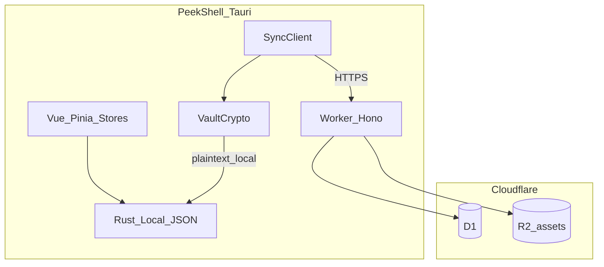
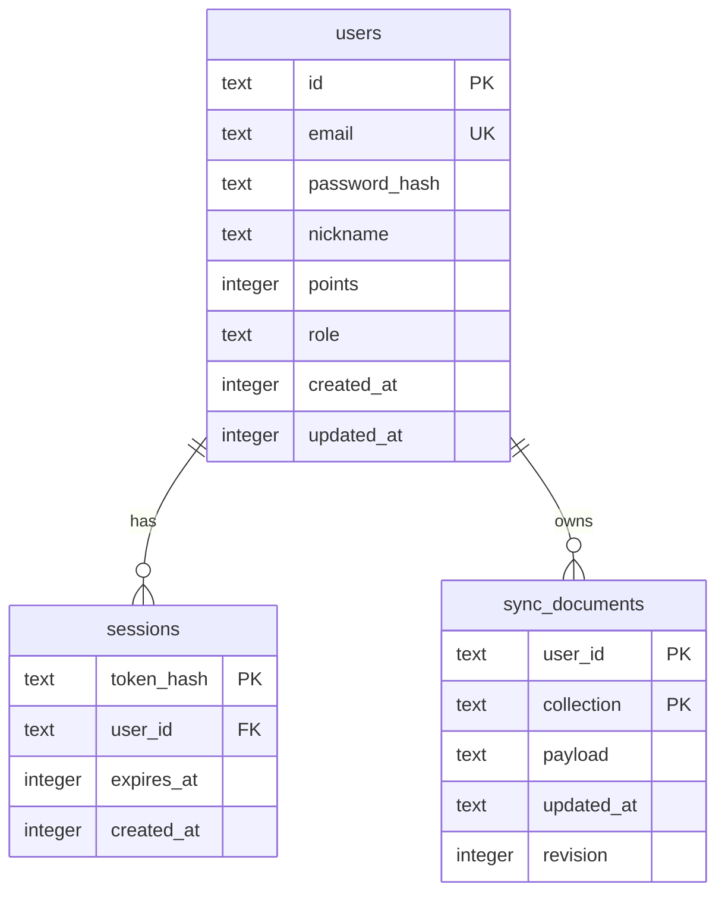
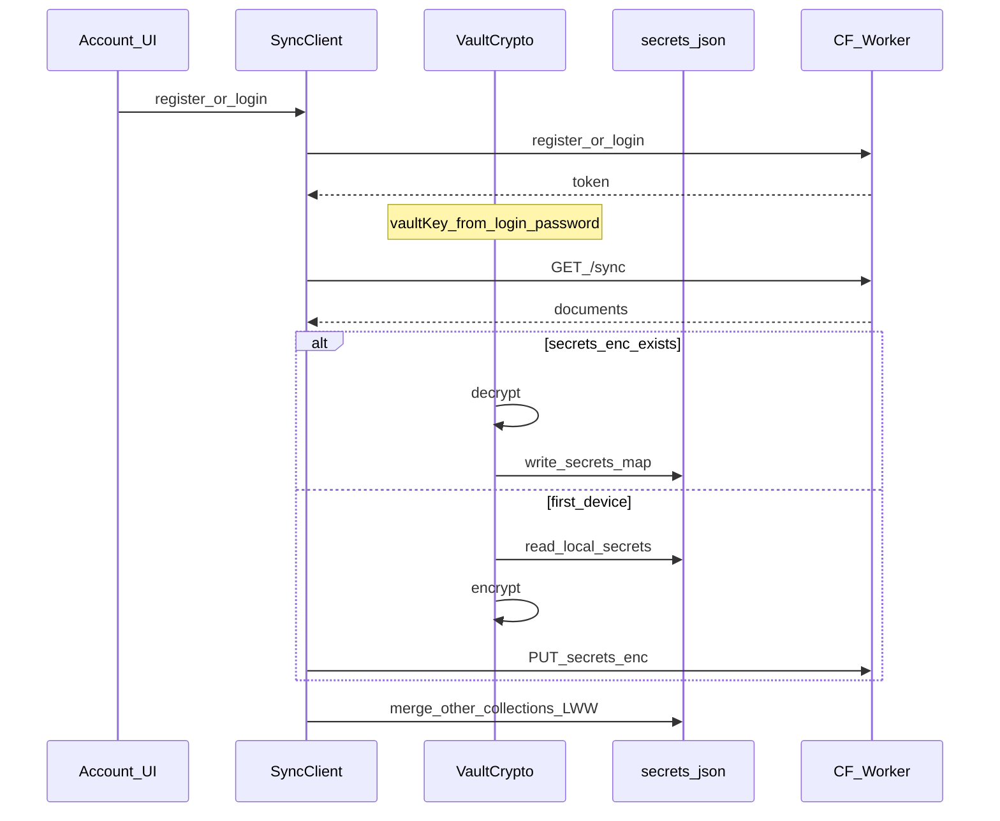

# 一期计划：云端数据同步

> 状态：方案已定，待实现  
> 技术栈：Cloudflare Worker + Hono + D1 + R2  
> 对应总规划：[Plan.md](../Plan.md) Phase 4「同步配置」

本文档是 PeekShell **云端账号与配置同步**的一期实现方案（含数据库设计）。本地仍以 JSON / localStorage 为主；云端为可同步镜像。

---

## 1. 目标与边界

用户通过 **邮箱 + 密码** 注册/登录后，多端同步以下数据：

| 集合 | 内容 | 本地来源 |
|------|------|----------|
| `hosts` | 主机分组 + 主机列表（不含密码明文） | Rust `hosts.json` |
| `display` | 显示偏好、主题、语言、面板宽度等 | `localStorage` |
| `models` | AI Provider 元数据（不含 API Key 明文） | Rust `ai-config.json` |
| `terminal` | 终端字体/配色/快捷键等（大图外置） | `localStorage` |
| `quick_commands` | 快捷命令分组与列表 | `localStorage` |
| `secrets_enc` | SSH 密码 / passphrase / AI API Key（客户端加密密文） | Rust `secrets.json` |

### 1.1 已拍板决策

1. **鉴权**：邮箱 + 密码直接注册/登录；**不发送邮件验证码**（一期不做邮箱所有权验证）。
2. **冲突**：按集合 **Last-Write-Wins**（整包替换，不做字段级三方合并）。
3. **密钥同步**：必须同步 SSH 密码、私钥口令、API Key；云端 **只存客户端 AEAD 密文**。
4. **Vault 密钥**：用 **同一登录密码** 在客户端派生加密密钥；服务端只存 `password_hash`，无法解开 `secrets_enc`。
5. **私钥文件**：不上传私钥文件内容；`privateKeyPath` 跨设备无效，新设备需重选私钥。
6. **大资源**：终端自定义背景图进 **R2**，JSON 中只存引用。

### 1.2 一期明确不做

- 邮件验证码 / 忘记密码邮件重置
- 私钥文件内容上云
- 冲突时的手动合并 UI
- 积分/角色的客户端自助修改

> 代价：他人可能抢注邮箱；忘记密码且无已登录设备时，无法解密云端密钥。可接受为 MVP。

---

## 2. 总体架构



| 组件 | 职责 |
|------|------|
| Worker + Hono | 注册/登录、会话、同步 API（无邮件依赖） |
| D1 | 用户、会话、同步文档（3 张表） |
| R2 | 终端背景等大文件 |
| VaultCrypto（桌面端） | 登录密码派生密钥 → 加解密 secrets |

### 2.1 建议仓库布局

```
PeekShell/
  cloud/
    src/
      index.ts
      routes/auth.ts
      routes/sync.ts
      routes/assets.ts
      lib/db.ts
      lib/password.ts
      lib/session.ts
    wrangler.toml
    migrations/0001_init.sql
  src/sync/
    client.ts
    vault.ts
    collections.ts
```

加解密优先放 **Rust**（`aes-gcm` + `argon2`）；Vue 负责账号 UI 与触发同步。

---

## 3. 数据库设计（D1：3 张表）

### 3.1 设计原则

- 不按主机/命令拆行：每个同步集合整包 JSON 存一行。
- 用户资料（昵称、积分、角色、时间）全部在 `users`，不另拆资料表。
- 密钥不另开表：`sync_documents.collection = 'secrets_enc'`。
- **积分、角色仅服务端可改**。

### 3.2 ER



### 3.3 DDL

```sql
CREATE TABLE users (
  id TEXT PRIMARY KEY,
  email TEXT NOT NULL UNIQUE COLLATE NOCASE,
  password_hash TEXT NOT NULL,
  nickname TEXT NOT NULL,              -- 注册可传，默认取邮箱 @ 前缀
  points INTEGER NOT NULL DEFAULT 0,   -- 仅服务端/管理逻辑修改
  role TEXT NOT NULL DEFAULT 'user',   -- user | sponsor | admin（可扩展）
  created_at INTEGER NOT NULL,         -- 注册时间 unix ms
  updated_at INTEGER NOT NULL          -- 资料或密码等变更时刷新
);

CREATE TABLE sessions (
  token_hash TEXT PRIMARY KEY,
  user_id TEXT NOT NULL REFERENCES users(id) ON DELETE CASCADE,
  expires_at INTEGER NOT NULL,
  created_at INTEGER NOT NULL
);

CREATE TABLE sync_documents (
  user_id TEXT NOT NULL REFERENCES users(id) ON DELETE CASCADE,
  collection TEXT NOT NULL,
  -- hosts|display|models|terminal|quick_commands|secrets_enc
  payload TEXT NOT NULL,
  updated_at TEXT NOT NULL,            -- ISO-8601 UTC，客户端写入时间
  revision INTEGER NOT NULL,           -- 服务端单调递增，防乱序覆盖
  PRIMARY KEY (user_id, collection)
);

CREATE INDEX idx_sessions_user ON sessions(user_id);
```

### 3.4 `users` 字段约定

| 字段 | 含义 | 谁可写 |
|------|------|--------|
| `nickname` | 昵称 | 用户本人（注册 / PATCH） |
| `points` | 积分，默认 `0` | 仅服务端（赞助入账等，一期可预留） |
| `role` | 角色，默认 `user` | 仅服务端 / admin |
| `created_at` | 注册时间 | 仅插入时写入 |
| `updated_at` | 最近更新时间 | 改昵称、改密、改积分/角色时刷新 |

---

## 4. 同步文档 payload 形状

### 4.1 `hosts`（元数据，无密码字段）

```json
{
  "groups": ["未分组", "prod"],
  "hosts": [
    {
      "id": "...",
      "name": "...",
      "group": "prod",
      "host": "1.2.3.4",
      "port": 22,
      "note": "",
      "username": "root",
      "authType": "password",
      "privateKeyPath": null
    }
  ]
}
```

### 4.2 `display` / `models` / `terminal` / `quick_commands`

与本地 store / 文件形状对齐；`models` 不含 API Key 明文（key 只走 `secrets_enc`）。

`terminal` 中自定义背景图：将 data URL 换成 R2 引用（如 `r2:{userId}/terminal/{hash}`）。

### 4.3 `secrets_enc`

明文（仅本机 `secrets.json`，**永不上传**）：

```json
{
  "<hostId>/password": "...",
  "<hostId>/passphrase": "...",
  "ai-provider/<providerId>/api-key": "sk-..."
}
```

上传信封：

```json
{
  "v": 1,
  "kdf": "argon2id",
  "salt": "<base64>",
  "nonce": "<base64>",
  "ciphertext": "<base64>",
  "verifier": "<base64>"
}
```

| 字段 | 含义 |
|------|------|
| `salt` | 首次创建 vault 时生成，随信封同步；改密时轮换并重加密 |
| `ciphertext` | AES-256-GCM(UTF-8 JSON of secrets map) |
| `verifier` | 用派生密钥加密固定串（如 `peekshell-vault-v1`），用于校验密码对错 |

**派生**：`vaultKey = Argon2id(loginPassword, salt)`。

服务端 `password_hash` 与客户端 vault 派生必须使用 **不同盐/目的**，避免服务端材料可复用为解密密钥。

---

## 5. API 设计（Hono）

### 5.1 鉴权（无发信）

| Method | Path | 说明 |
|--------|------|------|
| `POST` | `/auth/register` | `{ email, password, nickname? }` → 创建用户（`points=0`, `role=user`），返回 `token` + 资料；邮箱占用 → `409` |
| `POST` | `/auth/login` | `{ email, password }` → 返回 `token` + 资料 |
| `POST` | `/auth/logout` | 删除当前 session |
| `GET` | `/auth/me` | 当前用户公开资料（不含 `password_hash`） |
| `PATCH` | `/auth/profile` | `{ nickname }` → 更新昵称并刷新 `updated_at` |
| `POST` | `/auth/change-password` | `{ oldPassword, newPassword }` → 更新 hash；客户端随后重加密 `secrets_enc` |

**`/auth/me` 响应示例：**

```json
{
  "id": "...",
  "email": "a@example.com",
  "nickname": "a",
  "points": 0,
  "role": "user",
  "createdAt": 1710000000000,
  "updatedAt": 1710000000000
}
```

密码最小长度等由服务端强制；登录/注册做 IP 限流。

### 5.2 同步

| Method | Path | 说明 |
|--------|------|------|
| `GET` | `/sync` | 返回全部集合 |
| `GET` | `/sync/:collection` | 单集合 |
| `PUT` | `/sync/:collection` | `{ payload, updatedAt, baseRevision }` |

- `secrets_enc`：服务端只校验信封 JSON 结构，**不解密**。
- LWW：比较 `updatedAt`；`revision` 防乱序；冲突返回 `409` + 服务端副本。

### 5.3 R2 资源

| Method | Path | 说明 |
|--------|------|------|
| `POST` | `/assets/upload` | key = `{userId}/terminal/{hash}` |
| `GET` | `/assets/:key` | 鉴权下载 |

上传前对内容做 hash 去重。

---

## 6. 客户端流程



### 6.1 场景

1. **注册**：邮箱 + 密码 + 可选昵称 → 加密上传各集合。
2. **新设备登录**：邮箱 + 密码 → 拉取 → 解密 `secrets_enc` 写入本机。
3. **改密**：`change-password` → 本机旧密解密、新密重加密 → PUT。
4. **忘记密码**：一期无邮件重置；需已登录设备改密。
5. **资料**：展示昵称、积分、角色、注册/更新时间；用户仅可改昵称。

### 6.2 合并策略

- 非密钥集合：整包 LWW。
- `secrets_enc`：整包 LWW，获胜密文解密后覆盖本机 `secrets.json`。
- 不把密码写入 `hosts` JSON。

### 6.3 桌面端接入点

| 模块 | 位置 | 改动 |
|------|------|------|
| Vault | Rust + `src/sync/vault.ts` | 密码派生、加解密 |
| 同步核心 | `src/sync/` | 注册/登录、六集合 pull/push |
| 凭证 | `src-tauri/src/credentials.rs` | 变更后重加密上传 |
| 主机 / AI / UI prefs | 对应 Pinia store + Rust | 变更防抖后 enqueue sync |
| 账号 UI | 设置「账号与同步」 | 注册、登录、改昵称、积分/角色展示、改密、立即同步 |

登录成功后内存仅保留 vaultKey（或短暂保留密码用于派生）；退出账号时清零。

---

## 7. 安全要点

- 服务端只存 `password_hash`、`token_hash`；HTTPS only。
- 不做邮箱验证时，防滥用靠限流。
- 服务端永不持有可解密 secrets 的材料。
- 客户端密码 / vaultKey 不写日志；退出清零。
- 忘记登录密码 ≈ 丢失云端密钥解密能力。
- R2 对象按 `userId` 前缀隔离。

---

## 8. 一期落地步骤

| 步骤 | 内容 |
|------|------|
| A | 搭建 `cloud/`：Wrangler + Hono + D1 migration（3 表）+ R2 binding |
| B | 邮箱+密码 register/login、sessions、`/auth/me`、改昵称/改密 |
| C | `GET/PUT /sync` + 按集合 LWW（含 `secrets_enc`） |
| D | 桌面端 Vault（登录密码派生）+ SyncClient + 六集合挂钩 |
| E | 终端背景图走 R2（可紧随或略后） |

### 后续可选（非一期必做）

- 邮件验证 / 忘记密码重置
- 加密同步私钥文件内容
- OS 钥匙串缓存登录态
- 积分入账与赞助角色开通管理接口

---

## 9. 关键约束（保持简单）

1. D1 **仅 3 张表**；业务同步数据几乎全在 `sync_documents.payload`。
2. 无 OTP、无发信依赖。
3. 密钥明文不上云；用登录密码客户端加密。
4. 冲突一期不做三方合并 UI。
5. Worker 无状态；R2 用 binding。

---

## 10. 验收清单（一期）

- [ ] 可用邮箱+密码注册、登录、退出；`/auth/me` 含昵称、积分、角色、时间
- [ ] 可修改昵称；不可通过客户端改积分/角色
- [ ] 五类配置 + 加密密钥可在两台设备间同步（LWW）
- [ ] 云端 D1 中 secrets 仅为密文；改密后旧设备需重新登录并用新密码解密
- [ ] 私钥文件内容未上传；新设备需重选私钥路径
- [ ] （若已做 E）终端自定义背景可通过 R2 跨设备恢复
